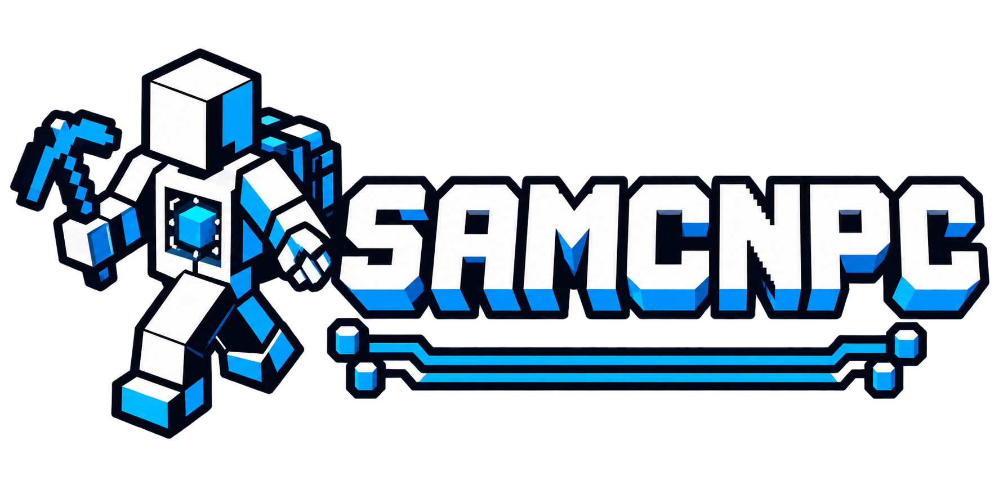

<p align="center">
  
</p>

<h1 align="center">SAMCNPC</h1>
<p align="center"><strong>A player-like body. Deterministic behavior. Optional AI planning.</strong></p>
<p align="center">Minecraft Java 1.20.1 · Forge · Kotlin · Java 17</p>
<p align="center"><a href="#english">English</a> · <a href="#polski">Polski</a> · <a href="#deutsch">Deutsch</a></p>

> **Early development publication.** This repository brings together the source,
> tools and documentation. It is not a claim that every Minecraft task or arbitrary
> natural-language request is supported. Use disposable worlds when evaluating new packs.

## Repositories

| Project | Role | Source in this checkout |
|---|---|---|
| [SAMCNPC Core](https://github.com/DasIstEin20/SAMCNPC_Core) | NPC body, mechanics, inventory, skin, permissions and public API | `samcnpc-core/` |
| [SAMCNPC Behavior](https://github.com/DasIstEin20/SAMCNPC_Behavior) | Deterministic rules, durable operations, recovery and external missions | `samcnpc-behavior/` |
| [SAMCNPC LLM](https://github.com/DasIstEin20/SAMCNPC_LLM) | Optional translation, supervision and high-level planning | `samcnpc-llm/` |
| [SAMCNPC Behavior Studio](https://github.com/DasIstEin20/SAMCNPC_Behavior_Studio) | Desktop graph editor, validation, JSON/ZIP exports and mission authoring | `studio/` |

This is the project navigation hub. All four Git submodules are siblings here.
The component repositories do not contain nested dependency submodules.
The game build produces **exactly three first-party mod JARs**; Studio is a separate desktop tool.

```text
SAMCNPC/
├── samcnpc-core/       physical capabilities and public API
├── samcnpc-behavior/   deterministic policy and execution
├── samcnpc-llm/        optional high-level planning
└── studio/            authoring application; not a Minecraft mod

Runtime dependency direction: LLM → Behavior → Core
```

<a id="english"></a>
## English

### What is SAMCNPC?

SAMCNPC adds persistent, player-like NPCs to Minecraft Forge 1.20.1. An NPC can carry
equipment, use tools, move through the world, perform bounded work and react to danger.
The project separates physical mechanics from decisions, so the same body can be
controlled explicitly, by deterministic behavior packs or through a validated planner.

The NPC is its own entity, with a deliberately designed player-like interface. It is
not a fabricated server player. The server authorizes world changes; clients render
the synchronized body, equipment and animations.

### The four components

**Core** provides the body: summoning, stable identity and summoner binding, a 36-slot
inventory, hotbar, equipment, movement, looking, interaction, tool use and combat
mechanics. The selected hotbar stack is the main hand, so it is not counted twice.
Core can run by itself and stays idle until something gives it an instruction.

An NPC uses its summoner's Minecraft skin. The profile snapshot is bounded and the
client reuses Minecraft's skin manager and caches. Classic/slim choice and normal
skin layers are supported; unavailable skins use the UUID-based default player skin.

**Behavior** decides what to do. JSON rules evaluate bounded observations, propose
actions and resolve competing channels deterministically. Existing durable operations
cover navigation, inventory preparation, transport, wood work, mining, soil preparation,
supported farming and planting, fishing, machine interaction and combat duties.
Each operation has its own definition, authorization, finite budget and real completion criterion.

Preparation and recovery reuse the same inventory facts, item queries, physical
transfers and task state. Exact `minecraft:coal` does not mean charcoal. A container
that cannot be observed is unavailable, not empty. Assigning a rule pack does not
automatically construct an operation; `run_*` actions normally advance work already admitted.

**LLM** is optional. Its role is high-level translation, supervision and planning over
published Behavior APIs. It does not get direct control of body channels, raw world
mutation or arbitrary commands. Core and Behavior work without a model or provider.
Real-model planning is experimental; successful deterministic fixtures do not prove
that a model understands every free-text mission. Experimental Planner V2 remains opt-in.

**Studio** is an EN/PL/DE desktop editor. Ordinary graphs connect conditions, rules and
action proposals. `.samgraph` projects remain editable; exports are runtime JSON or
native SAMCNPC ZIP bundles. The separate mission view connects stages after verified
success, shows explicit operation/completion data and keeps ordinary action wires unchanged.
It includes JSON preview, local validation, undo/redo and example projects.

### Installation and first steps

The tested toolchain is Minecraft **1.20.1**, Forge **47.4.21**, **Java 17** and
Kotlin for Forge **4.12.0**. Build dependencies are pinned in `gradle.properties`.
Use matching module versions. Core is required; Behavior adds autonomous work;
LLM is optional. Studio does not go into the Minecraft `mods` directory.

1. Prepare a Forge 1.20.1 instance with Java 17 and the required Kotlin for Forge runtime.
2. Build the source below and place the selected SAMCNPC mod JARs in the instance's `mods/` folder.
3. Start a disposable test world or server. Use `/samcnpc` help and command completion
   to summon and inspect an NPC before assigning work.
4. Start Studio with `studio/START_WINDOWS.bat`, or `python studio/studio.py` with Tkinter available.
5. Export and install a pack, reload it and assign it to the intended NPC.

| External document | Installation location |
|---|---|
| Loose rule pack JSON | `<instance>/config/samcnpc/behaviors/` |
| Rule/mission ZIP bundle | `<instance>/resources/samcnpc/behaviors/` |
| Editable Studio project | Keep outside runtime input directories |

These are SAMCNPC external resources, not vanilla resource packs or datapacks.
Run `/samcnpc behavior reload` after saving. Duplicate IDs, unknown components,
malformed documents and unsafe archives reject the candidate reload; the last valid
registry stays active. Rule packs cannot contain scripts, class names or commands.

### Missions and completion

A mission keeps three separate things: requirements, a finite stage plan and the
exact task bound to the current stage. Each stage refers to a pack and may admit an
existing typed operation. Progress requires authoritative success and explicit
postconditions. Standing still, an accepted action or an elapsed timeout is not success.

Final stock and physical state are checked again at the end. Historical task success
belongs to an identified stage and task. Pause/cancel take precedence; changed packs
or uncertain restart boundaries hold for review instead of blindly replaying effects.
Separate world, task and mission saves are not claimed to be an atomic transaction.

```text
/samcnpc behavior mission list
/samcnpc behavior mission start <NPC> acceptance:tutorial
/samcnpc behavior mission status <NPC>
/samcnpc behavior mission pause <NPC>
/samcnpc behavior mission resume <NPC>
/samcnpc behavior mission cancel <NPC>
```

See `studio/examples/missions/` for the three-stage tutorial and the larger deterministic
mission. Coordinates and sources are an explicit fixture contract; adapt them to your
own permitted work site before use. Tools, scaffolding and requested output are distinct resources.

### Build and contribute

```bash
git clone --recurse-submodules https://github.com/DasIstEin20/SAMCNPC.git
cd SAMCNPC
./gradlew clean build
```

On Windows use `gradlew.bat`. After changing the umbrella revision, run
`git submodule update --init` to select its pinned sibling revisions. Module repositories
have no nested gitlinks. Standalone dependent builds accept local sibling paths; see
their own build instructions. No model is required for ordinary tests.

Fork the component you want to improve, create a focused branch and send a pull request
to that component. Small fixes, tested behavior packs, translations and reproducible
gameplay reports are welcome. For changes spanning modules, keep the dependency direction
Core ← Behavior ← LLM and describe the matching component revisions.

Report the exact source revision, Forge/Java versions, pack/mission document, initial
inventory and work area, reproduction steps and actual outcome. Keep secrets, personal
worlds and account details out of reports. Gameplay claims require real client/server
or Forge integration evidence; compilation alone is not proof.

<a id="polski"></a>
## Polski

### Czym jest SAMCNPC?

SAMCNPC dodaje do Minecraft Forge 1.20.1 trwałe postacie NPC o możliwościach zbliżonych
do gracza: ekwipunek, narzędzia, ruch, pracę w świecie i reakcje na zagrożenia.
Mechanika ciała jest oddzielona od decyzji. Dzięki temu postacią można sterować
jawnymi poleceniami, deterministyczną paczką zachowań albo walidowanym planem.
NPC jest osobnym typem encji; o zmianach w świecie decyduje autorytatywny serwer.

### Podział projektu

**Core** odpowiada za przywołanie, tożsamość, powiązanie z przywołującym, 36 pól
ekwipunku, pasek szybkiego dostępu, wyposażenie, ruch, interakcje, narzędzia i mechanikę
walki. Główna ręka jest widokiem wybranego pola hotbara, nie dodatkowym magazynem.
Sam Core pozostaje bezczynny, dopóki nie otrzyma instrukcji.

NPC korzysta ze skina przywołującego, pamięci podręcznej Minecraft oraz wariantu
classic/slim i zwykłych warstw wyglądu. Gdy skina nie można rozwiązać, używany jest
domyślny skin zależny od UUID.

**Behavior** wybiera działania. Reguły JSON obserwują ograniczony stan, zgłaszają
intencje i rozstrzygają konflikty kanałów deterministycznie. Trwałe operacje obejmują
nawigację, przygotowanie ekwipunku, transport, drewno, wydobycie, przygotowanie gleby,
obsługiwane warianty upraw, sadzenie, łowienie, maszyny oraz zadania bojowe.
Każda operacja ma konkretny cel, zakres uprawnień, skończony budżet i kryterium zakończenia.

Przygotowanie i naprawa problemów korzystają ze wspólnych danych o przedmiotach,
fizycznych transferów i stanu zadania. `minecraft:coal` oznacza dokładnie węgiel,
nie węgiel drzewny. Nieznana zawartość skrzyni nie oznacza pustej skrzyni.
Przypisanie paczki nie jest automatycznym utworzeniem operacji; akcje `run_*`
zazwyczaj kontynuują już jawnie zlecone zadanie.

**LLM** jest opcjonalną warstwą tłumaczenia, nadzoru i planowania wysokiego poziomu.
Korzysta z publicznych operacji Behavior. Nie otrzymuje dostępu do dowolnych komend,
bezpośrednich zmian świata ani kanałów sterowania ciałem. Core i Behavior działają
bez modelu. Planowanie językiem naturalnym jest eksperymentalne; poprawny test
deterministyczny nie dowodzi rozumienia dowolnego polecenia. Planner V2 pozostaje opcją.

**Studio** to edytor EN/PL/DE z grafem warunków, reguł i propozycji akcji,
projektami `.samgraph`, podglądem JSON, lokalną walidacją, undo/redo i eksportem ZIP.
Osobny widok misji pokazuje przejścia po potwierdzonym sukcesie. Przewody zwykłych
akcji nadal nie oznaczają „najpierw A, po zakończeniu B”.

### Uruchomienie i własne paczki

Zweryfikowany zestaw to **Minecraft 1.20.1, Forge 47.4.21, Java 17 i Kotlin for Forge
4.12.0**. Zależności kompilacji są przypięte w `gradle.properties`. Zgodne JAR-y modów
umieść w `mods/`: Core jest wymagany, Behavior dodaje autonomiczne zadania, LLM jest
opcjonalny. Studio uruchom przez `studio/START_WINDOWS.bat` albo `python studio/studio.py`.

Luźny JSON reguł trafia do `config/samcnpc/behaviors/`, a natywny ZIP do
`resources/samcnpc/behaviors/` w katalogu instancji. To zasoby SAMCNPC, nie vanilla
datapack/resource pack. Po zapisie użyj `/samcnpc behavior reload`. Błędny import nie
zastępuje ostatniego poprawnego rejestru. Paczki nie zawierają kodu, skryptów ani komend.

Misja oddziela wymagania, plan etapów i konkretne uruchomione zadanie. Etap przechodzi
dalej dopiero po potwierdzeniu wyniku i warunków. Zapas końcowy, gleba, wyposażenie
i pozycja są ponownie sprawdzane na końcu. Pauza i anulowanie mają pierwszeństwo.
Niepewny zapis albo zmiana paczki zatrzymują wykonanie do przeglądu, bez automatycznego
powtarzania możliwych już efektów. Nie deklarujemy atomowego zapisu świata i wszystkich stanów.

Przykłady znajdują się w `studio/examples/missions/`. Mały samouczek obejmuje narzędzie,
marsz i powrót. Większa misja łączy przygotowanie, 32 dębowe kłody, co najmniej 30 bruku
i 2 sztuki dokładnego węgla, powrót oraz przygotowanie pola. Współrzędne, źródła i odbiorcy
są jawnym kontraktem przykładu — trzeba dostosować je do dozwolonego miejsca pracy.
Komendy `mission list/start/status/pause/resume/cancel` są pokazane w sekcji angielskiej.

### Kod źródłowy i zgłoszenia

Sklonuj główne repo przez `git clone --recurse-submodules`, potem wykonaj
`gradlew.bat clean build` na Windows lub `./gradlew clean build` na pozostałych systemach.
Wszystkie cztery repozytoria są tu równorzędnymi submodułami; moduły nie zawierają
zagnieżdżonych zależności Git. Powstają dokładnie trzy pierwszoplanowe JAR-y modów.

Zrób fork wybranego modułu, utwórz gałąź z konkretną zmianą i wyślij pull request
do tego modułu. Przydadzą się poprawki, sprawdzone paczki zachowań, tłumaczenia
i odtwarzalne zgłoszenia z gry. Przy zmianach obejmujących kilka modułów zachowaj
kierunek zależności Core ← Behavior ← LLM i podaj pasujące rewizje.

W zgłoszeniu podaj rewizję kodu, wersje narzędzi, dokument paczki/misji, początkowy
ekwipunek i obszar, kroki odtworzenia oraz faktyczny wynik. Kompilacja nie dowodzi
poprawnego działania w grze. Nowe paczki sprawdzaj na jednorazowych światach.

<a id="deutsch"></a>
## Deutsch

### Was ist SAMCNPC?

SAMCNPC ergänzt Minecraft Forge 1.20.1 um persistente, spielerähnliche NPCs mit
Inventar, Ausrüstung, Werkzeugen, Bewegung, begrenzten Arbeitsaufträgen und Reaktionen
auf Gefahren. Körpermechanik und Entscheidungen sind getrennt. Derselbe NPC kann
daher durch ausdrückliche Anweisungen, deterministische Verhaltenspakete oder einen
validierten Plan gesteuert werden. Der NPC ist ein eigener Entitätstyp; Weltänderungen
werden auf dem maßgeblichen Server geprüft und ausgeführt.

### Die Komponenten

**Core** stellt Beschwörung, Identität, Beschwörerbindung, 36 Inventarplätze, Hotbar,
Ausrüstung, Bewegung, Interaktion, Werkzeugnutzung und Kampfmechanik bereit.
Die Haupthand verweist auf den ausgewählten Hotbar-Stapel und wird nicht doppelt gezählt.
Core allein bleibt ohne Anweisung untätig.

Der NPC verwendet den Minecraft-Skin seines Beschwörers und die vorhandenen
Minecraft-Skin-Caches. Classic/ Slim und die üblichen Hautebenen werden unterstützt.
Ist der Skin nicht verfügbar, wird ein UUID-basierter Standard-Skin verwendet.

**Behavior** trifft Entscheidungen. JSON-Regeln lesen begrenzte Beobachtungen,
schlagen Aktionen vor und lösen Kanalkonflikte deterministisch. Persistente Operationen
umfassen Navigation, Inventarvorbereitung, Transport, Holzarbeit, Bergbau,
Bodenvorbereitung, unterstützte Anbau- und Pflanzvarianten, Angeln, Maschinen und Kampfaufträge.
Jede Operation besitzt einen definierten Zweck, Berechtigungsbereich, endliches Budget
und ein tatsächliches Abschlusskriterium.

Vorbereitung und Wiederherstellung verwenden gemeinsame Inventardaten, physische
Transfers und Aufgabenstände. `minecraft:coal` bedeutet genau Kohle, nicht Holzkohle.
Unbekannter Truheninhalt wird nicht als leer behandelt. Ein zugewiesenes Regelpaket
erstellt nicht automatisch eine Operation; `run_*`-Aktionen führen meist bereits zugelassene Arbeit weiter.

**LLM** ist die optionale Übersetzungs-, Aufsichts- und Planungsschicht. Sie verwendet
öffentliche Behavior-Operationen, ohne direkte Weltänderungen, beliebige Befehle oder
zeitweise Kontrolle über Körperkanäle. Core und Behavior funktionieren ohne Modell.
Sprachbasierte Planung bleibt experimentell; erfolgreiche deterministische Tests
beweisen kein Verständnis beliebiger Texte. Planner V2 bleibt ausdrücklich optional.

**Studio** ist der EN/PL/DE-Editor für Bedingungen, Regeln und Aktionsvorschläge.
Er bietet bearbeitbare `.samgraph`-Projekte, JSON-Vorschau, lokale Prüfung,
Rückgängig/Wiederholen und JSON/ZIP-Export. Die getrennte Missionsansicht verbindet
Stufen nach bestätigtem Erfolg. Gewöhnliche Aktionsverbindungen sind keine Ablaufsequenz.

### Installation, Pakete und Missionen

Die geprüfte Kombination ist **Minecraft 1.20.1, Forge 47.4.21, Java 17 und Kotlin for
Forge 4.12.0**. Build-Versionen stehen fest in `gradle.properties`. Passende Mod-JARs
gehören in `mods/`: Core ist erforderlich, Behavior ergänzt autonome Arbeit und LLM
ist optional. Studio wird separat über `studio/START_WINDOWS.bat` oder `python studio/studio.py` gestartet.

Regel-JSON gehört nach `config/samcnpc/behaviors/`, ZIP-Bündel nach
`resources/samcnpc/behaviors/` im Instanzverzeichnis. Dies sind SAMCNPC-Ressourcen,
keine Vanilla-Daten- oder Ressourcenpakete. Danach `/samcnpc behavior reload`
ausführen. Ungültige Dokumente oder Archive ersetzen niemals das letzte gültige Register.
Pakete enthalten keinen ausführbaren Code, keine Skripte und keine beliebigen Befehle.

Eine Mission trennt Anforderungen, Stufenplan und die genaue laufende Aufgabe.
Fortschritt erfordert bestätigten Erfolg und Nachbedingungen. Endbestände, Boden,
Ausrüstung und Zielposition werden am Ende erneut beobachtet. Pause und Abbruch
haben Vorrang. Unklare Neustarts oder geänderte Pakete führen zur Prüfung statt zur
blinden Wiederholung. Welt-, Aufgaben- und Missionsspeicher werden nicht als atomar bezeichnet.

Unter `studio/examples/missions/` liegen das dreistufige Tutorial sowie eine größere
Mission mit Vorbereitung, 32 Eichenstämmen, mindestens 30 Bruchstein und 2 Stück
genauer Kohle, Rückkehr und Feldvorbereitung. Koordinaten und erlaubte Quellen/Ziele
gehören zum ausdrücklichen Beispielvertrag; passen Sie diese an den erlaubten Arbeitsort an.
Die Befehle `mission list/start/status/pause/resume/cancel` stehen im englischen Abschnitt.

### Bauen und Fehler melden

Das Hauptrepository mit `git clone --recurse-submodules` klonen und anschließend
unter Windows `gradlew.bat clean build`, sonst `./gradlew clean build` ausführen.
Alle vier Repositorys sind hier gleichrangige Submodule; die Komponenten besitzen
keine verschachtelten Git-Abhängigkeiten. Der Build erzeugt genau drei eigene Mod-JARs.

Erstellen Sie einen Fork der gewünschten Komponente, einen Branch für eine konkrete
Änderung und einen Pull Request an diese Komponente. Fehlerkorrekturen, geprüfte
Verhaltenspakete, Übersetzungen und reproduzierbare Spielberichte sind willkommen.
Bei Änderungen über mehrere Module die Abhängigkeit Core ← Behavior ← LLM beibehalten
und die zusammengehörigen Revisionen angeben.

Fehlermeldungen sollten Revision, Werkzeugversionen, Paket/Mission, Startinventar,
Arbeitsbereich, reproduzierbare Schritte und das tatsächliche Ergebnis enthalten.
Ein erfolgreicher Compilerlauf belegt keine Spielfunktion. Neue Pakete zunächst
in entbehrlichen Testwelten ausprobieren.

## Licenses

Each component retains its own license file. Minecraft, Forge and third-party
dependencies have their own terms. SAMCNPC is not an official Minecraft product.
